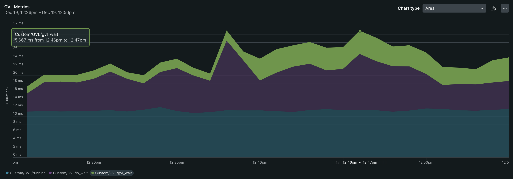

# GVL Metrics Middleware

`gvl_metrics_middleware` is a Ruby gem that provides middleware for monitoring and gathering metrics on Global VM Lock (
GVL) in multi-threaded Ruby applications. This gem leverages
[the `gvl_timing` gem](https://github.com/jhawthorn/gvl_timing) to measure time spent in the GVL and invokes a provided
callback with the collected metrics data.

## Installation

Add the gem to your application’s Gemfile, and run `bundle install` to install the gem:

```bash
gem 'gvl_metrics_middleware', git: "https://github.com/speedshop/gvl_metrics_middleware.git"
```

## Usage

The `gvl_metrics_middleware` automatically inserts the nessecary middleware into your application’s stack. To get
started, configure a callback to handle the GVL metrics. Place the following configuration in your
application’s `config/initializers`directory:

```ruby
# config/initializers/gvl_metrics_middleware.rb
GvlMetricsMiddleware.configure do |config|
  config.rack do |total, running, io_wait, gvl_wait|
    # Your code here...
  end

  config.sidekiq do |total, running, io_wait, gvl_wait|
    # Your code here...
  end
end
```

For example, if you would like to record the GVL metrics in New Relic, you can use the following configuration.

```ruby
# config/initializers/gvl_metrics_middleware.rb
GvlMetricsMiddleware.configure do |config|
  config.rack do |total, running, io_wait, gvl_wait|
    NewRelic::Agent.record_metric("Custom/Rack/GVL/total", total)
    NewRelic::Agent.record_metric("Custom/Rack/GVL/running", running)
    NewRelic::Agent.record_metric("Custom/Rack/GVL/io_wait", io_wait)
    NewRelic::Agent.record_metric("Custom/Rack/GVL/gvl_wait", gvl_wait)
  end

  config.sidekiq do |total, running, io_wait, gvl_wait, options|
    NewRelic::Agent.record_metric("Custom/Sidekiq/GVL/total", total)
    NewRelic::Agent.record_metric("Custom/Sidekiq/GVL/running", running)
    NewRelic::Agent.record_metric("Custom/Sidekiq/GVL/io_wait", io_wait)
    NewRelic::Agent.record_metric("Custom/Sidekiq/GVL/gvl_wait", gvl_wait)

    # If you want to record metrics for specific queues and job classes, you can do so like this:
    queue = options[:queue]
    job_class = options[:job_class]
    NewRelic::Agent.record_metric("Custom/Sidekiq/GVL/#{queue}/#{job_class}/total", total)
    NewRelic::Agent.record_metric("Custom/Sidekiq/GVL/#{queue}/#{job_class}/running", running)
    NewRelic::Agent.record_metric("Custom/Sidekiq/GVL/#{queue}/#{job_class}/io_wait", io_wait)
    NewRelic::Agent.record_metric("Custom/Sidekiq/GVL/#{queue}/#{job_class}/gvl_wait", gvl_wait)
  end
end
```

After configuring, you should be able to set up custom charts in New Relic to visualize the GVL metrics. Here is an
example chart:



## Available Metrics

The `gvl_metrics_middleware` reports the following metrics. The metrics are all reported in nanoseconds.

- **`total`**: The total duration of the request processing time, which is the sum of `running`, `io_wait`,
  and `gvl_wait`. This corresponds to the returned value from the value returned by the `GVLTiming::Timer#duration`
  method in `gvl_timing`.
- **`running`**: The time a thread held the GVL and performed work (a.k.a CPU time). This corresponds to the
  value returned by the `GVLTiming::Timer#cpu_duration` method.
- **`io_wait`**: The time spent waiting for I/O operations after releasing the GVL. This corresponds to the
  value returned by the `GVLTiming::Timer#idle_duration` method.
- **`gvl_wait`**: The time spent waiting to acquire the GVL. This corresponds to the value returned by
  the `GVLTiming::Timer#stalled_duration` method.

## Performance Overhead

The overhead introduced by `gvl_metrics_middleware` is minimal. Benchmarking has shown only a 1% difference in response
times between scenarios with and without GVL metrics collection. This result has been validated through an A/A test,
where both the control and experiment groups ran identical code, and the difference remained at 1%. This 1% overhead is
consistent with those reported in [Shopify's `gvltools`](https://github.com/Shopify/gvltools?tab=readme-ov-file#usage),
where the overhead was measured at 1-5% in a production environment.

As stated in [the README of `gvltools`](https://github.com/Shopify/gvltools?tab=readme-ov-file#usage)`, the exact
overhead is not yet known. However, unless you observe an immediate, significant jump in response times after
deployment, the overhead is negligible and should not impact application performance. This makes the middleware a
reliable choice for tracking GVL metrics in production environments.

## Development

After checking out the repo, run `bin/setup` to install dependencies. Then, run `rake test` to run the tests. You can
also run `bin/console` for an interactive prompt that will allow you to experiment.

To install this gem onto your local machine, run `bundle exec rake install`. To release a new version, update the
version number in `version.rb`, and then run `bundle exec rake release`, which will create a git tag for the version,
push git commits and the created tag, and push the `.gem` file to [rubygems.org](https://rubygems.org).

## Contributing

Bug reports and pull requests are welcome on GitHub at https://github.com/speedshop/gvl_metrics_middleware. This
project is intended to be a safe, welcoming space for collaboration, and contributors are expected to adhere to
the [code of conduct](https://github.com/speedshop/gvl_metrics_middleware/blob/main/CODE_OF_CONDUCT.md).

## License

The gem is available as open source under the terms of the [MIT License](https://opensource.org/licenses/MIT).

## Code of Conduct

Everyone interacting in the GvlMetricsMiddleware project's codebases, issue trackers, chat rooms and mailing lists is
expected to follow
the [code of conduct](https://github.com/speedshop/gvl_metrics_middleware/blob/main/CODE_OF_CONDUCT.md).
